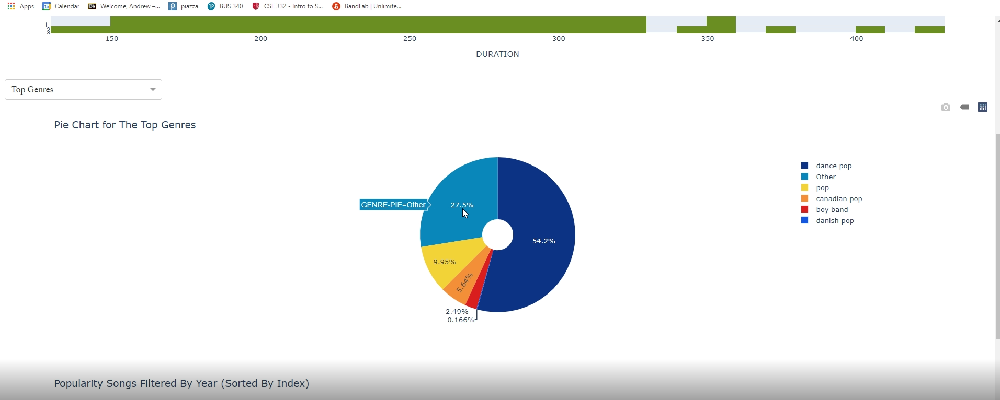

# CSE332-Data-Visualization-Project-Fall-2020
Final lab for my Data Visualization class--CSE 332, at Stony Brook University.
This dataset gives the most-streamed Spotify songs of the 2010s.
I aimed to uncover WHY these songs garnered the most streams, in typical visualization fashion.
I used Python, specifically Plotly, in combination with Dash to create a simple HTML dashboard.

Given the dataset's various attributes, I ultimately realized that the majority of "casual" music listeners enjoy songs that are more energetic and more uplifting. The few outliers in this analysis were songs that were either very slow and lethargic, or too long in duration.

LAB PRESENTATION @ https://www.youtube.com/watch?v=Xcwd-CVK03Q&feature=youtu.be
